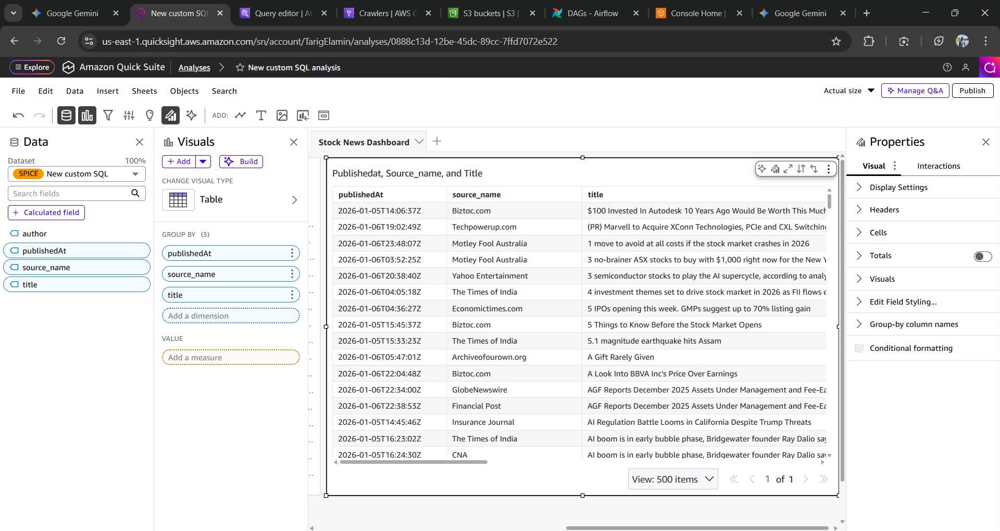

# 📈 End-to-End Stock Market Data Pipeline

**Project Status:** ✅ Complete  
**Role:** Cloud Data Architect & Engineer  
**Tech Stack:** AWS (EC2, S3, Glue, Athena, QuickSight), Terraform, Docker, Apache Airflow, Python.

---

## 📖 Project Overview
This project is a fully automated, cloud-native data pipeline designed to ingest, process, and visualize stock market news data. The goal was to build a secure, scalable architecture that transforms raw API data into actionable business intelligence without manual intervention.

It demonstrates **Infrastructure as Code (IaC)**, **Least-Privilege Security**, and **Serverless Analytics**.

### 🏗️ Architecture


**Data Flow:**
1.  **Ingestion:** Apache Airflow (running on EC2) fetches live news data from external APIs.
2.  **Storage:** Raw JSON data is stored securely in an **AWS S3 Data Lake**.
3.  **Cataloging:** **AWS Glue Crawlers** automatically inspect the schema and update the Data Catalog.
4.  **Analysis:** **AWS Athena** provides a Serverless SQL interface to query the S3 files directly.
5.  **Visualization:** **Amazon QuickSight** connects to Athena to visualize trends (e.g., Top Publishers, Keyword Frequency).

---

## 🛠️ Technologies Used

| Category | Tools | Use Case |
| :--- | :--- | :--- |
| **Infrastructure** | **Terraform** | Provisioning EC2, S3, IAM Roles, and Glue Crawlers as code. |
| **Orchestration** | **Apache Airflow** | Scheduling daily Python ingestion jobs (DAGs). |
| **Compute** | **AWS EC2 (t3.medium)** | Hosting the Airflow Docker container. |
| **Storage** | **AWS S3** | Data Lake for raw and processed data. |
| **Analytics** | **AWS Glue & Athena** | Serverless ETL and SQL querying. |
| **Visualization** | **Amazon QuickSight** | Business Intelligence Dashboarding. |
| **Security** | **AWS IAM** | Custom roles for EC2/Glue to access S3 (Zero hardcoded keys). |

---

## 🚀 Key Features
* **Secure Authentication:** No API keys are stored in the codebase. The EC2 instance uses an **IAM Instance Profile** to authenticate with S3 securely.
* **Infrastructure as Code:** The entire environment (Network, Compute, Storage, Security) can be destroyed and recreated with a single `terraform apply` command.
* **Resiliency:** The Airflow server uses Swap Memory and auto-scaling storage volumes to handle production workloads on cost-effective hardware.
* **Serverless Querying:** Uses Athena to run complex SQL queries on raw JSON files by unnesting complex data structures.

---

## 📸 Screenshots

### 1. The Dashboard (Amazon QuickSight)

*Insight: Real-time analysis of stock market news coverage by publisher.*


### 2. The Orchestrator (Airflow)

*Insight: Daily scheduled jobs handling ingestion and S3 upload.*

---

## 💻 How to Run This Project

**Prerequisites:**
* AWS Account
* Terraform installed
* NewsAPI Key

**1. Deploy Infrastructure**
```bash
cd terraform
terraform init
terraform apply -auto-approve

2. Configure Airflow

SSH into the EC2 instance.

Add your NEWS_API_KEY to Airflow Variables.

Trigger the news_ingestion_s3_v2 DAG.

3. Visualizing

Run the Glue Crawler to populate the catalog.

Connect Amazon QuickSight to the Athena database portfolio_news_db.

👨‍💻 Author
Tarig Elamin Cloud Data Architect & Engineer 
LinkedIn: linkedin.com/in/tarigelamin | Portfolio: https://tarigelamin.com | GitHub: github.com/tarigelamin1997
